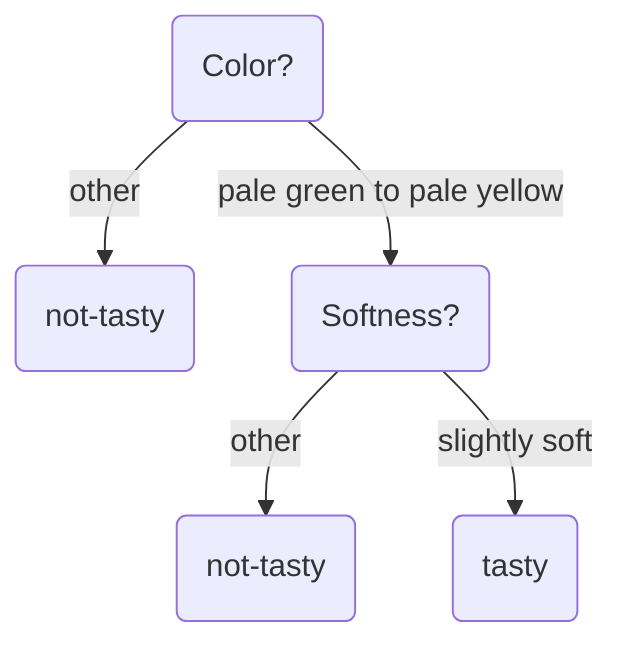

202306011039

Tags: #machinelearning

# Decision Tree
A type of [[Model]] where each node has two possible paths which lead to more nodes or leaves.  The leaves are the responses from the provided input literals.

The above example is parameterized by a two-dimensional bit vector, where the first bit represents Color and the second bit represents Softness.

---
# References
